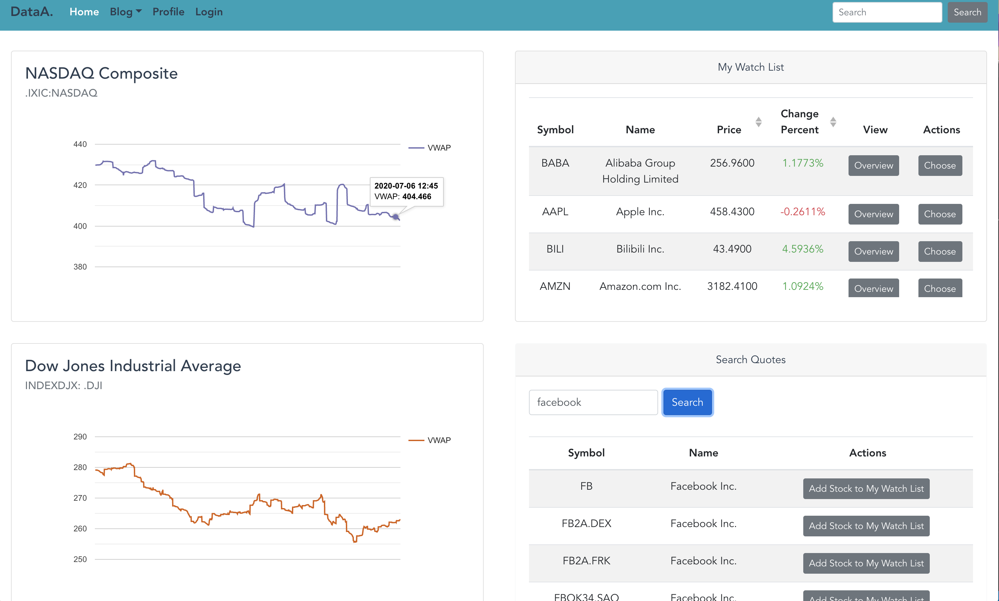
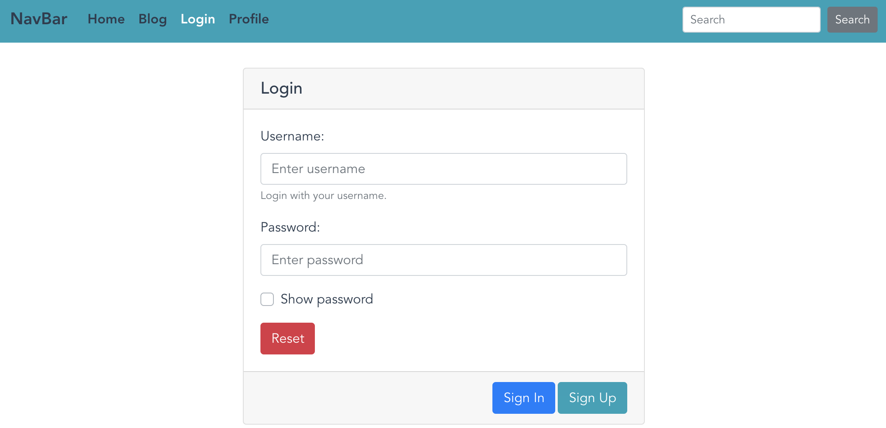
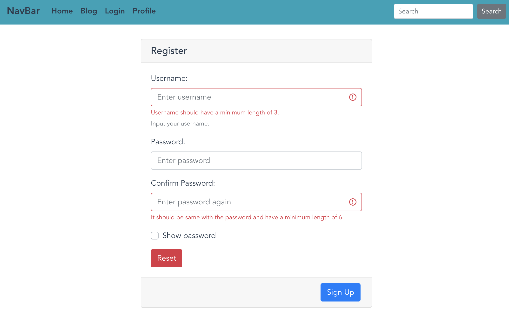

# data-analyze-app(Under Construction ^_- )

This app is for practicing springboot + vue.js

### back-end

Springboot, Oauth2, Spring Security

### front-end

Vue, Vuex, bootstrap, css, axios

## Project setup
```
npm install
```

#### Compiles and hot-reloads for development
```
npm run serve
```

#### Compiles and minifies for production
```
npm run build
```

#### Lints and fixes files
```
npm run lint
```

#### Customize configuration
See [Configuration Reference](https://cli.vuejs.org/config/).

## Template Demo

#### Home


#### Sign In/Up


#### Sign Up



