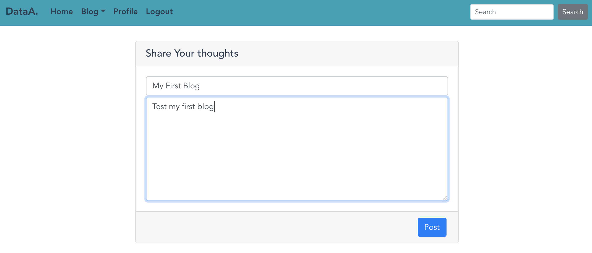

# data-analyze-app(Under Construction ^_- )

This app is for practicing springboot + vue.js

### back-end

Springboot, Oauth2, Spring Security

### front-end

Vue, Vuex, bootstrap, css, axios

#### Quote data API

The project uses a free alphavantage token, so the limit is 5 queries per minute, 500 per day. API documentation:

https://www.alphavantage.co/documentation/#

## Project setup
```
npm install
```

#### Compiles and hot-reloads for development
```
npm run serve
```

#### Compiles and minifies for production
```
npm run build
```

#### Lints and fixes files
```
npm run lint
```

#### Customize configuration
See [Configuration Reference](https://cli.vuejs.org/config/).

## Template Demo

#### Home


#### Company Overview


#### Sign In/Up


#### Sign Up


#### View My List


#### Add Stocks to My List


#### Post A blog


#### View My blogs


#### ERD


